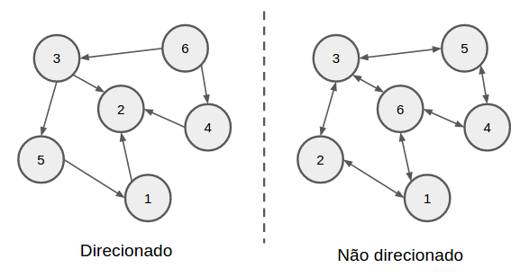
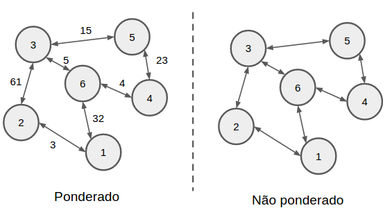
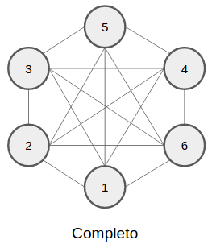
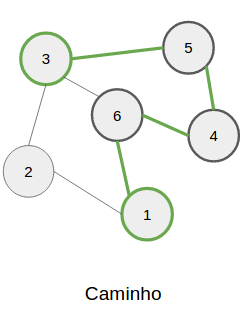
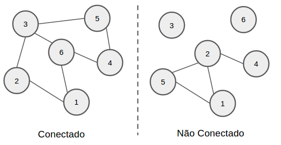
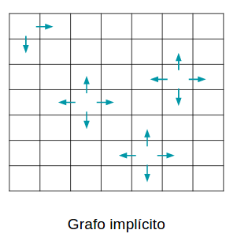

Grafos
======

Grafos são conjuntos de vértices e arestas conectados de forma direcionada/ordenada,
ou de forma não direcionada. Os vértices, ou nós, de um grafo guardam alguma informação
inerente ao problema, que podem ser o valor de algum item, ou nome de cidades,
ou nome de pessoas, ou até dados complexos. Já as arestas podem guardar, ou não, alguma informação,
esta informação é chamada de peso da aresta, ou custo da aresta.
Existem várias classificações para grafos, que podem
ser notadas a partir de dados do próprio grafos. Elas são importantes, pois existem
algoritmos que só funcionam com grafos de uma certa classificação, ou não funcionam
com grafos de uma classificação específica.

No quesito de direção das arestas, os grafos podem ser classificados como **direcionados**
e **não direcionados**. Caso exista uma aresta do grafo que aponte do vértice `A`
para o vértice `B`, e não exista nenhuma aresta que aponte do vértice `B` para o
vértice `A`, ou seja, caso não haja uma aresta oposta, o grafo é considerado **direcionado**.
Se qualquer aresta do grafo possua uma aresta oposta, ou seja, para qualquer aresta que aponte
do vértice `A -> B` (A para o B), existe outra que aponte do vértice `B -> A`, este
grafo é classificado como **não direcionado**.

Grafos não direcionados, tem a característica de a partir de qualquer vértice do grafo é
possivel chegar em qualquer outro vértice. Já nos direcionados, isso nem sempre é verdade,
pois pode existir algum caminho no grafo onde não é possível voltar para o vértice de origem.



Outra classificação que grafos possuem, é sobre o peso de suas arestas. Como dito
anteriormente, as arestas podem, ou não, guardar uma informação. Caso elas guardem
esta informação é chamada de peso, ou custo, e representa o custo de sair do vértice
`A` para o vértice `B`. Grafos que possuem arestas com peso são chamados de **grafos
ponderados**. Já os que as arestas não possuem pesos são os **grafos não ponderados**,
que podem ser interpretados como: não há nenhum custo envolvido para ir do vértice
`A` para o vértice `B`.



Caso um grafo possua `V` vértices, ele é considerado um **grafo completo** se para
cada par único de vértices `(A, B)`, exista uma aresta. Caso isso aconteça o grafo
terá um total de `E = V * (V - 1) / 2` arestas, que é o número máximo `E` de arestas
que um grafo pode ter. Em grafos completos, todo vértice é conectado a qualquer outro
vértice por uma aresta, fazendo com que qualquer caminho deste grafo tenha tamanho 1.



Para ir de um vértice a outro em um grafo é necessário seguir um **caminho** de arestas,
passando por vários vértices no caminho. Ou seja, um **caminho** é definido pelo
conjunto de arestas e vértices que estão entre `A` e `B`. É comum ter mais de um
caminho entre `A` e `B`, mas nem sempre todos eles tem o mesmo tamanho ou custo.
O **tamanho de um caminho** é definido pelo número de arestas que estão neste caminho.
Já o **custo do caminho** é definido pela soma dos pesos das arestas que estão no
caminho.



Se existe um caminho entre quaisquer vértices de um grafo, este grafo é considerado
**conectado**. Se há pelo menos um par de vértices que não existe nenhum caminho
entre eles, este grafo é considerado **não conectado**. Em um grafo é possível
identificar partes que estão conectadas e partes não conectadas, através desta
definição. Isto permite a redução do escopo de aplicação de alguns algoritmos.



Uma outra classificação de grafos, se dá pela maneira que a informação do problema
está disponibilizada. Alguns contextos permitem a interpretação da informação como
um grafo, estes grafos são chamados de **grafos implícitos**. São grafos que não
precisam da representação das arestas, elas podem ser interpretadas implicitamente.
Um exemplo são mapas de coordendas, onde pode se sair da posição `(x, y)` para qualquer
uma das 4 direnções: esquerda, direita, cima e baixo. Apesar de ser um mapa de coordenadas,
este contexto pode ser interpretado como um grafo implicito, onde os véritces são
os pares ordenados `(x, y)`, e as arestas estão implicitamente descritas nas direções
que pode se tomar a partir do par ordenado. Neste contexto, é possível ver que
para quase qualquer par ordenado, 4 arestas vão ser extraidas, uma para cada direção
indo para outro par ordenado.



## Representações

Existem 3 modos principais de se representar um grafo em programação competitiva.
Cada modo pode ser aplicado em diferentes algoritmos, e cada um gasta um espaço
em memória diferente. O modo a ser escolhido, vai depender do contexto e do algoritmo
que vai ser aplicado sobre este grafo.

### Matrix de Adjacências

Nesta representação é utilizada uma matriz para guardar quais vértices estão conectados
com outro vértices. Os indicies das linhas e colunas da matriz vão de `0 .. V - 1`,
onde `V` é o número de vértices. Para representar que o vértice `A` está ligado ao
vértice `B`, a célula da matriz com coluna `A` e linha `B` é marcada. Esta marcação
pode ser tanto um booleano, `true` ou `false`, quanto o peso da aresta que ligam os
dois.

Se nesta representação você quer fazer um grafo não direcionado, quando for marcar
a ligação na coluna `A` linha `B`, também marque a ligação coluna `B` linha `A`.

```cpp
#define MAX_V 1000

int G[MAX_V][MAX_V];

int main () {
    memeset(G, 0, sizeof G);

    int A = 2;   // vértice de id 2
    int B = 5;   // vértice de id 5
    G[A][B] = 1; // A -> B

    // Não direcionado
    G[B][A] = 1; // B -> A
}
```

O tanto de espaço que esta representação gasta é o equivalente a `V*V`. Além de
gastar bastante espaço, boa parte das células da matriz não são utilizadas, a não
ser que o grafo chegue próximo a ser um grafo completo. Então esta representação
costuma gastar muito espaço desnecessário em memória. Porém, em contra partida,
para saber se um vértice está ligado ao outro, é uma consulta constante de `O(1)`,
pois a única coisa necessária é ter o `id` dos dois vértices e consultar a célula.

A matriz de adjacencias é muito utilizada por algoritmos que agem sobre grafos implicitos.
Pois a maioria dos grafos implicitos são representados na forma matricial.

### Lista de Adjacências

Nesta representação há um array de `vector<int>`, onde cada casa do array representa
o `id` do vértice, e o `vector<int>` da casa guarda para quais vértices ele aponta.
Então se você quer fazer a ligação entre o vértice `A` e o vértice `B`, o vértice
`B` será adicionado no vector que está na posição `A` no seu array.

```cpp
#define MAX_V 1000

vector<int> G[MAX_V];

int main () {
    int A = 2;   // vértice de id 2
    int B = 5;   // vértice de id 5

    // A -> B
    G[A].push_back(B);

    // Não direcionado
    // B -> A
    G[B].push_back(A);
}
```

Caso seja necessário representar um grafo ponderado, é possível, ao invés de ter
um `vector<int>`, ter um vector de pares de int, onde o primeiro elemento do par
é o vértice e o segundo é peso da aresta.

```cpp
#define MAX_V 1000
using ii = pair<int, int>;

vector<ii> G[MAX_V];

int main () {
    int A = 2;   // vértice de id 2
    int B = 5;   // vértice de id 5

    // A -> B (aresta com peso de 45)
    G[A].push_back(ii(B, 45));

    // Não direcionado
    // B -> A (aresta com peso de 45)
    G[B].push_back(ii(A, 45));
}
```

Esta abordagem, em comparação com a abordagem da matrix de adjacências, consome
menos memória. Ela consome o equivalente a `V + E`, onde `V` é o número de vértices
e `E` é o número de arestas. Porém, para saber se um vértice está conectado a outro,
é necessário uma operação linear `O(n)` para percorrer todo o vector do indice `A`
do array, procurando pelo vértice `B`.

De todas as representações, a lista de adjacências é a mais utilizanda pelos
algoritmos.

### Lista de Arestas

Nesta representação, é guardada uma lista que descreve todas as arestas do grafo.
Caso `A` tenha uma aresta para `B`, então a lista vai guardar o elemento `(A, B)`.
O primeiro elemento deste par representa de onde a aresta está saindo, o segundo
representa onde ela está chegando. Caso o grafo seja não direcionado, para
todo par `(A, B)` deve ter um par `(B, A)` registrado na lista.

```cpp
using ii = pair<int, int>;

vector<ii> G;

int main () {
    int A = 2;   // vértice de id 2
    int B = 5;   // vértice de id 5

    // A -> B
    G.push_back(ii(A, B));

    // Não direcionado
    // B -> A
    G.push_back(ii(B, A));
}
```

Se o grafo for ponderado, ao invés de registar um par de inteiro, é necessário
registra um trio. Isso é possível de ser alcançado com o `pair<pair<int, int>, int>`.
Onde o primeiro par é o par explicado anteriormente, e o novo inteiro que acompanha
este par guarda o peso daquela aresta. É comum ver a representação `pair<int, pair<int, int> >`
também, ambas dão o mesmo resultado.

```cpp
using ii = pair<int, int>;
using iii = pair<ii, int>;

vector<iii> G;

int main () {
    int A = 2;   // vértice de id 2
    int B = 5;   // vértice de id 5

    // A -> B (aresta com peso de 45)
    G.push_back(iii(ii(A, B), 45));

    // Não direcionado
    // B -> A (aresta com peso de 45)
    G.push_back(iii(ii(B, A), 45));
}
```

De todas as formas de representação, a lista de aresta é a que menos é utilizada
pelos algoritmos. O espaço utilizado por ela em memória é equivalente a `E`,
que é o número de arestas. Porém para saber se `A` está conectado com `B`, é
necessário fazer uma operação linear `O(E)`.


## Algoritmos

O tópico de Grafos, é um dos tópicos mais extensos na quantidade de algoritmos.
Todos eles já foram tópicos de Maratonas de Programação da ACM ICPC, não há
um favorito, por isso é necessário estudar e aprender todos eles.

1. [Travessia](travessia.md)
    1. Componente Conectados
    1. [Flood Fill](flood-fill.md)
    1. Ordenação Topológica
    1. Grafos Bipartidos
    1. Identificação de arestas
    1. Pontes e Pontos de Articulação
    1. Componentes Fortemente Conectados
1. Árvore Geradora Mínima
1. Algoritmos de Menor Caminho
    1. Single Source Shortest Path (SSSP)
    1. All-Pais Shortest Path (APSP)
1. Network Flow

## Referências

HALIM, Steve; HALIM, Felix. [Competitive Programming 3](http://cpbook.net/), Lulu, 2013.
